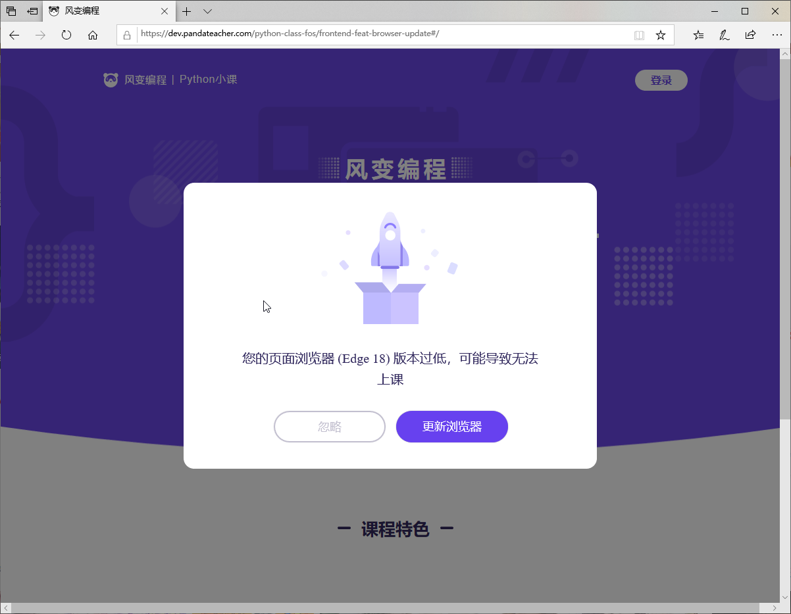

# 浏览器更新
基于 browser-update 封装的浏览器更新检测方案

## Preview


## 安装
```sh
npm install @forchange/browser --save
```
or
```sh
yarn add @forchange/browser --save
```


## 使用

```javascript
import browserUpdate from '@forchange/browser'
browserUpdate(options)
```

```html
<!-- 引入ui样式 -->
<link rel="stylesheet" type="text/css" href="https://res.pandateacher.com/YU5EVOAS1608262413089.css">
<!-- 引入脚本 -->
<script src="https://res.pandateacher.com/SFGIRZ1S1608261981445.umd"></script>
<!-- 调用 -->
<script>window.browserUp({required: {chrome:false}})</script>
```

#### options配置项
[详细配置](http://browser-update.org/zh/customize.html)
```javascript
{ 
  // 制定需要提醒的浏览器版本,低于此版本的浏览器会被提醒
  // f:22 ---> Firefox < 22 会被通知
  // 负数标明比最新版本低多少个版本的浏览器能被接受
  // c:-5 ---> Chrome < 35  会收到通知，假设 Chrome 的最新版本为 40.
  // 语义版本需要加引号 为字符串,可以设置false,代表这款浏览器都不兼容
  required:{
    chrome:-1,
    firefox:-1,
    edge:-1,
    uc:-1,
    safari:-1,
    ie: false,
    opera: -1,
    yandex: -3,
    vivaldi: '1.95',
    samsung: '12.1'
  },
  reminder:20, // x小时后重复显示通知 0为一直显示
  reminderClosed:150, // x小时后重复显示通知，即使用户已明确关闭
  test:false, // true为总显示提示条 （测试用）
  lang:'zh-CN',
  text:'', 
  // 自定义文字
  // 占位符 {brow_name} 会被替换成当前浏览器名称， {up_but} 会被替换成更新按钮的链接的标签内容，而 {ignore_but} 会被替换成忽略按钮的标签内容。
  // 示例︰ "您的网页浏览器 ({brow_name}) 已过期：<a{up_but}>更新浏览器</a> <a{ignore_but}>忽略</a>。"
  noCloseBtn:false, // 不显示忽略按钮
  url:'' // 跳转新窗口链接
}
```

#### text 自定义配置项
``` javascript
text: {
  msg:'Your web browser ({brow_name}) is out of date.',
  msgmore: 'Update your browser for more security, speed and the best experience on this site.', 
  bupdate: 'Update browser', 
  bignore: 'Ignore'
}
```

#### css样式
browser-update默认设置了提示的样式，您可以使用自己的css样式来覆盖他们。为来确保正确覆盖您需要额外向您的样式规则添加一些选择器，例如：
```css
body .buorg { 
  font-size:20px
}
```
全局样式加上屏蔽test生成报错元素
```css
.buorg .buorg-test {
  display: none;
}
```

#### 测试  
- 设置`test: true`界面报错不需关心
- 如果您打开的网页的链接末尾带有 #test-bu ，那么通知条会一直生成。例如： `http://browser-update.org/#test-bu` 请在新的标签页中打开该网址以保证网页被正确地重新加载。[更多详细信息（英文）](https://github.com/browser-update/browser-update/wiki/Test-the-notification)

## 通知
封装 `browser-update@3.3.25`